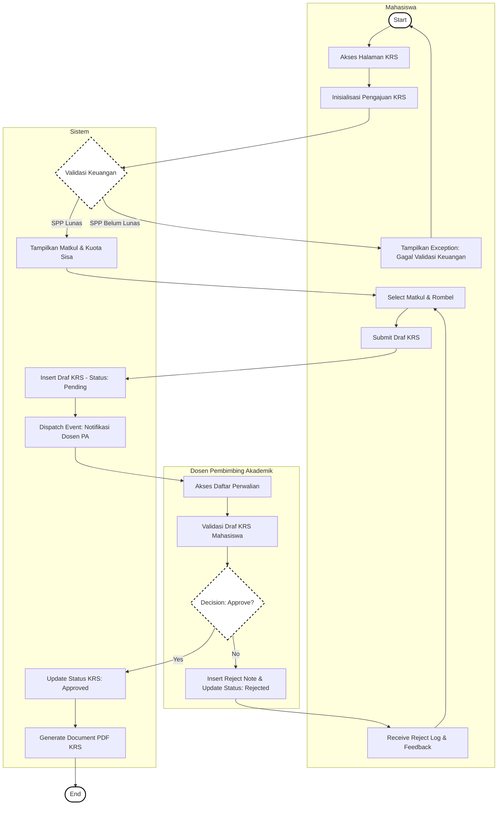

# Activity Diagram: Penyusunan & Persetujuan KRS Online

```mermaid
flowchart TD
    %% Styling
    classDef startEnd fill:#fff,stroke:#000,stroke-width:2px;
    classDef decision fill:#fff,stroke:#000,stroke-dasharray: 5 5,stroke-width:2px;

    subgraph Mahasiswa
        A([Start]):::startEnd
        B[Akses Halaman KRS]
        C[Inisialisasi Pengajuan KRS]
        D[Tampilkan Exception: Gagal Validasi Keuangan]
        E[Select Matkul & Rombel]
        F[Submit Draf KRS]
        G[Receive Reject Log & Feedback]
    end

    subgraph Sistem
        H{Validasi Keuangan}:::decision
        I[Tampilkan Matkul & Kuota Sisa]
        J[Insert Draf KRS - Status: Pending]
        K[Dispatch Event: Notifikasi Dosen PA]
        L[Update Status KRS: Approved]
        M[Generate Document PDF KRS]
    end

    subgraph DosenPA["Dosen Pembimbing Akademik"]
        N[Akses Daftar Perwalian]
        O[Validasi Draf KRS Mahasiswa]
        P{Decision: Approve?}:::decision
        Q[Insert Reject Note & Update Status: Rejected]
    end

    A --> B
    B --> C
    C --> H
    H -- SPP Belum Lunas --> D
    D --> A
    H -- SPP Lunas --> I
    I --> E
    E --> F
    F --> J
    J --> K
    K --> N
    N --> O
    O --> P
    P -- No --> Q
    Q --> G
    G --> E
    P -- Yes --> L
    L --> M
    M --> Z([End]):::startEnd
```
