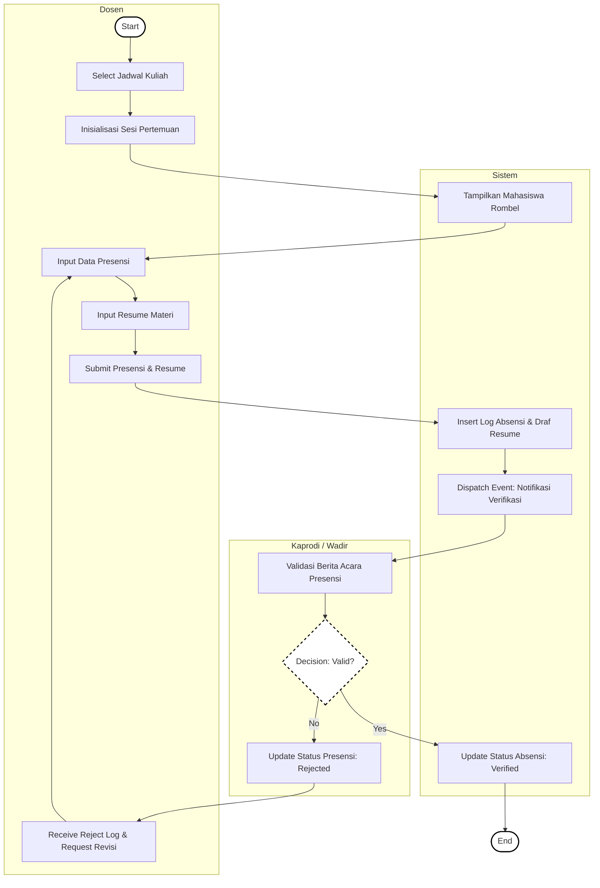

# Activity Diagram: Pencatatan & Verifikasi Presensi Kuliah

```mermaid
flowchart TD
    %% Styling
    classDef startEnd fill:#fff,stroke:#000,stroke-width:2px;
    classDef decision fill:#fff,stroke:#000,stroke-dasharray: 5 5,stroke-width:2px;

    subgraph Dosen
        A([Start]):::startEnd
        B[Select Jadwal Kuliah]
        C[Inisialisasi Sesi Pertemuan]
        D[Input Data Presensi]
        E[Input Resume Materi]
        F[Submit Presensi & Resume]
        G[Receive Reject Log & Request Revisi]
    end

    subgraph Sistem
        H[Tampilkan Mahasiswa Rombel]
        I[Insert Log Absensi & Draf Resume]
        J[Dispatch Event: Notifikasi Verifikasi]
        K[Update Status Absensi: Verified]
    end

    subgraph Pimpinan["Kaprodi / Wadir"]
        L[Validasi Berita Acara Presensi]
        M{Decision: Valid?}:::decision
        N[Update Status Presensi: Rejected]
    end

    A --> B
    B --> C
    C --> H
    H --> D
    D --> E
    E --> F
    F --> I
    I --> J
    J --> L
    L --> M
    M -- No --> N
    N --> G
    G --> D
    M -- Yes --> K
    K --> Z([End]):::startEnd
```
