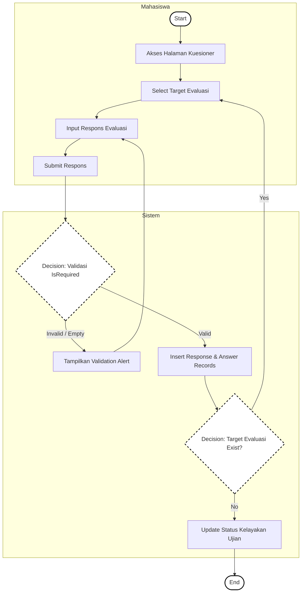

# Activity Diagram: Pengisian Evaluasi & Kuesioner Pelayanan

```mermaid
flowchart TD
    %% Styling
    classDef startEnd fill:#fff,stroke:#000,stroke-width:2px;
    classDef decision fill:#fff,stroke:#000,stroke-dasharray: 5 5,stroke-width:2px;

    subgraph Mahasiswa
        A([Start]):::startEnd
        B[Akses Halaman Kuesioner]
        C[Select Target Evaluasi]
        D[Input Respons Evaluasi]
        E[Submit Respons]
    end

    subgraph Sistem
        F{Decision: Validasi IsRequired}:::decision
        G[Tampilkan Validation Alert]
        H[Insert Response & Answer Records]
        I{Decision: Target Evaluasi Exist?}:::decision
        J[Update Status Kelayakan Ujian]
    end

    A --> B
    B --> C
    C --> D
    D --> E
    E --> F
    F -- Invalid / Empty --> G
    G --> D
    F -- Valid --> H
    H --> I
    I -- Yes --> C
    I -- No --> J
    J --> Z([End]):::startEnd
```
