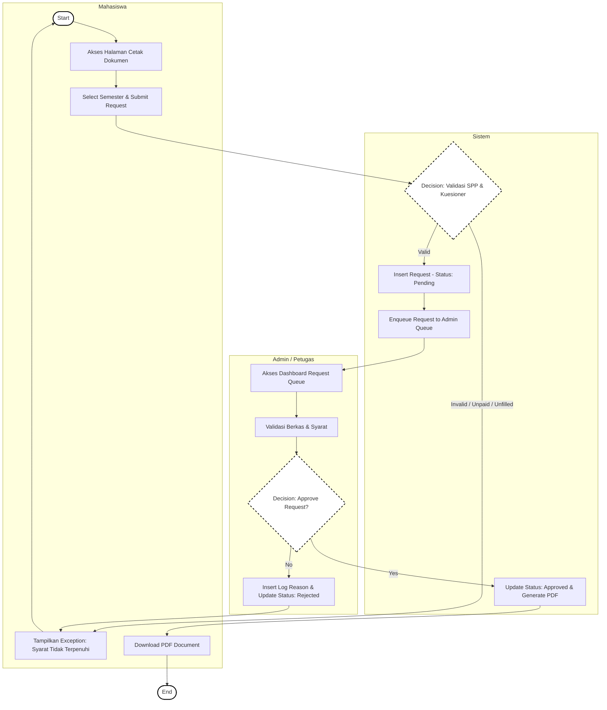

# Activity Diagram: Pengajuan & Validasi Cetak Kartu Ujian / KHS

```mermaid
flowchart TD
    %% Styling
    classDef startEnd fill:#fff,stroke:#000,stroke-width:2px;
    classDef decision fill:#fff,stroke:#000,stroke-dasharray: 5 5,stroke-width:2px;

    subgraph Mahasiswa
        A([Start]):::startEnd
        B[Akses Halaman Cetak Dokumen]
        C[Select Semester & Submit Request]
        D[Tampilkan Exception: Syarat Tidak Terpenuhi]
        E[Download PDF Document]
    end

    subgraph Sistem
        F{Decision: Validasi SPP & Kuesioner}:::decision
        G[Insert Request - Status: Pending]
        H[Enqueue Request to Admin Queue]
        I[Update Status: Approved & Generate PDF]
    end

    subgraph Admin["Admin / Petugas"]
        J[Akses Dashboard Request Queue]
        K[Validasi Berkas & Syarat]
        L{Decision: Approve Request?}:::decision
        M[Insert Log Reason & Update Status: Rejected]
    end

    A --> B
    B --> C
    C --> F
    F -- Invalid / Unpaid / Unfilled --> D
    D --> A
    F -- Valid --> G
    G --> H
    H --> J
    J --> K
    K --> L
    L -- No --> M
    M --> D
    L -- Yes --> I
    I --> E
    E --> Z([End]):::startEnd
```
