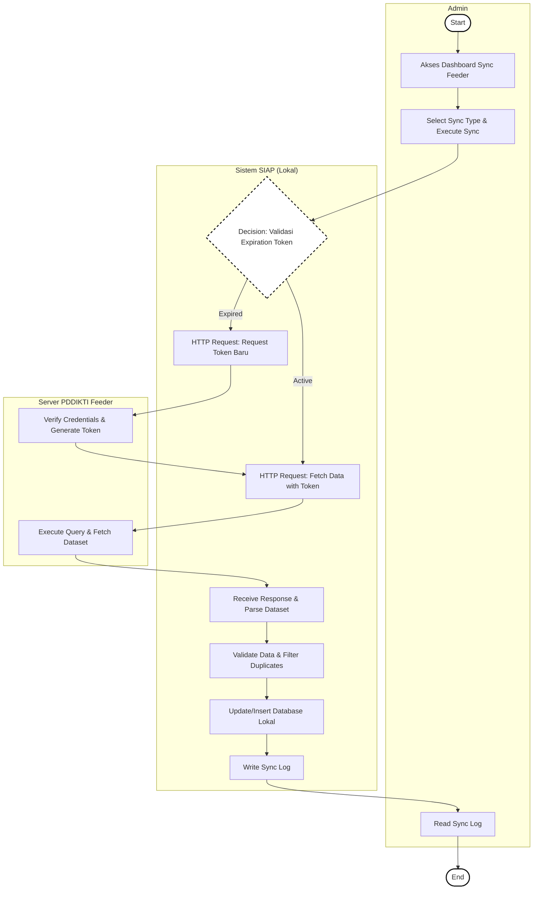

# Activity Diagram: Sinkronisasi Data dengan PDDIKTI Feeder

```mermaid
flowchart TD
    %% Styling
    classDef startEnd fill:#fff,stroke:#000,stroke-width:2px;
    classDef decision fill:#fff,stroke:#000,stroke-dasharray: 5 5,stroke-width:2px;

    subgraph Admin
        A([Start]):::startEnd
        B[Akses Dashboard Sync Feeder]
        C[Select Sync Type & Execute Sync]
        D[Read Sync Log]
    end

    subgraph SistemLokal["Sistem SIAP (Lokal)"]
        E{Decision: Validasi Expiration Token}:::decision
        F[HTTP Request: Request Token Baru]
        G[HTTP Request: Fetch Data with Token]
        H[Receive Response & Parse Dataset]
        I[Validate Data & Filter Duplicates]
        J[Update/Insert Database Lokal]
        K[Write Sync Log]
    end

    subgraph ServerFeeder["Server PDDIKTI Feeder"]
        L[Verify Credentials & Generate Token]
        M[Execute Query & Fetch Dataset]
    end

    A --> B
    B --> C
    C --> E
    E -- Expired --> F
    F --> L
    L --> G
    E -- Active --> G
    G --> M
    M --> H
    H --> I
    I --> J
    J --> K
    K --> D
    D --> Z([End]):::startEnd
```
