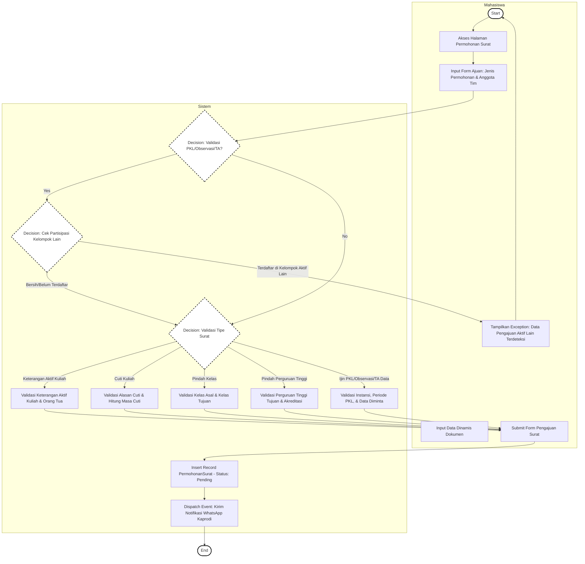

# Activity Diagram: Pengajuan Surat

```mermaid
flowchart TD
    %% Styling
    classDef startEnd fill:#fff,stroke:#000,stroke-width:2px;
    classDef decision fill:#fff,stroke:#000,stroke-dasharray: 5 5,stroke-width:2px;

    subgraph Mahasiswa
        A([Start]):::startEnd
        B[Akses Halaman Permohonan Surat]
        C[Input Form Ajuan: Jenis Permohonan & Anggota Tim]
        D[Tampilkan Exception: Data Pengajuan Aktif Lain Terdeteksi]
        E[Input Data Dinamis Dokumen]
        F[Submit Form Pengajuan Surat]
    end

    subgraph Sistem
        G{Decision: Validasi PKL/Observasi/TA?}:::decision
        H{Decision: Cek Partisipasi Kelompok Lain}:::decision
        I{Decision: Validasi Tipe Surat}:::decision
        J[Validasi Keterangan Aktif Kuliah & Orang Tua]
        K[Validasi Alasan Cuti & Hitung Masa Cuti]
        L[Validasi Kelas Asal & Kelas Tujuan]
        M[Validasi Perguruan Tinggi Tujuan & Akreditasi]
        N[Validasi Instansi, Periode PKL, & Data Diminta]
        O[Insert Record PermohonanSurat - Status: Pending]
        P[Dispatch Event: Kirim Notifikasi WhatsApp Kaprodi]
    end

    A --> B
    B --> C
    C --> G
    G -- Yes --> H
    H -- Terdaftar di Kelompok Aktif Lain --> D
    D --> A
    H -- Bersih/Belum Terdaftar --> I
    G -- No --> I

    I -- Keterangan Aktif Kuliah --> J
    I -- Cuti Kuliah --> K
    I -- Pindah Kelas --> L
    I -- Pindah Perguruan Tinggi --> M
    I -- Ijin PKL/Observasi/TA Data --> N

    J --> F
    K --> F
    L --> F
    M --> F
    N --> F

    F --> O
    O --> P
    P --> Z([End]):::startEnd
```
