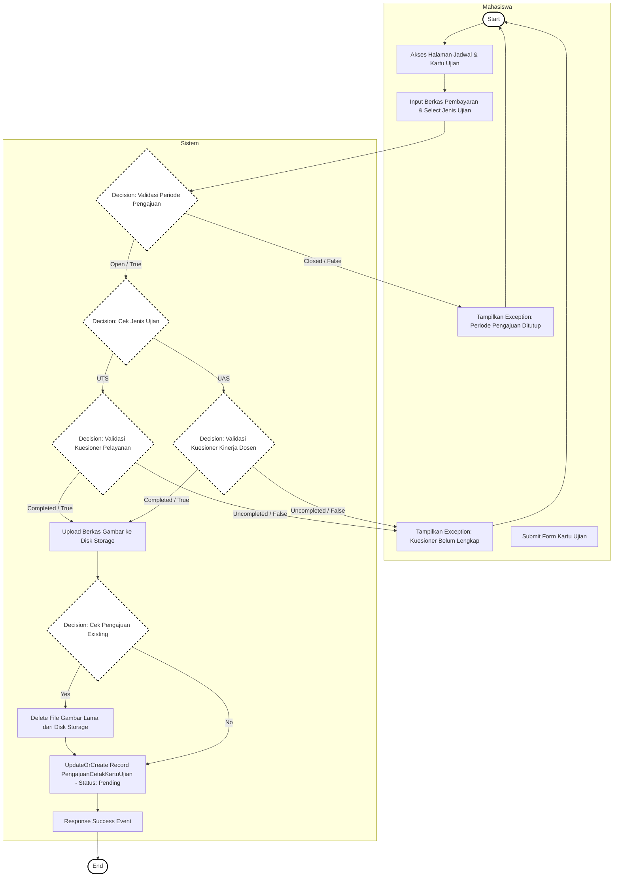

# Activity Diagram: Pengajuan Kartu Ujian

```mermaid
flowchart TD
    %% Styling
    classDef startEnd fill:#fff,stroke:#000,stroke-width:2px;
    classDef decision fill:#fff,stroke:#000,stroke-dasharray: 5 5,stroke-width:2px;

    subgraph Mahasiswa
        A([Start]):::startEnd
        B[Akses Halaman Jadwal & Kartu Ujian]
        C[Input Berkas Pembayaran & Select Jenis Ujian]
        D[Tampilkan Exception: Periode Pengajuan Ditutup]
        E[Tampilkan Exception: Kuesioner Belum Lengkap]
        F[Submit Form Kartu Ujian]
    end

    subgraph Sistem
        G{Decision: Validasi Periode Pengajuan}:::decision
        H{Decision: Cek Jenis Ujian}:::decision
        I{Decision: Validasi Kuesioner Pelayanan}:::decision
        J{Decision: Validasi Kuesioner Kinerja Dosen}:::decision
        K[Upload Berkas Gambar ke Disk Storage]
        L{Decision: Cek Pengajuan Existing}:::decision
        M[Delete File Gambar Lama dari Disk Storage]
        N[UpdateOrCreate Record PengajuanCetakKartuUjian - Status: Pending]
        O[Response Success Event]
    end

    A --> B
    B --> C
    C --> G
    G -- Closed / False --> D
    D --> A
    G -- Open / True --> H

    H -- UTS --> I
    I -- Uncompleted / False --> E
    I -- Completed / True --> K

    H -- UAS --> J
    J -- Uncompleted / False --> E
    E --> A
    J -- Completed / True --> K

    K --> L
    L -- Yes --> M
    M --> N
    L -- No --> N
    N --> O
    O --> Z([End]):::startEnd
```
