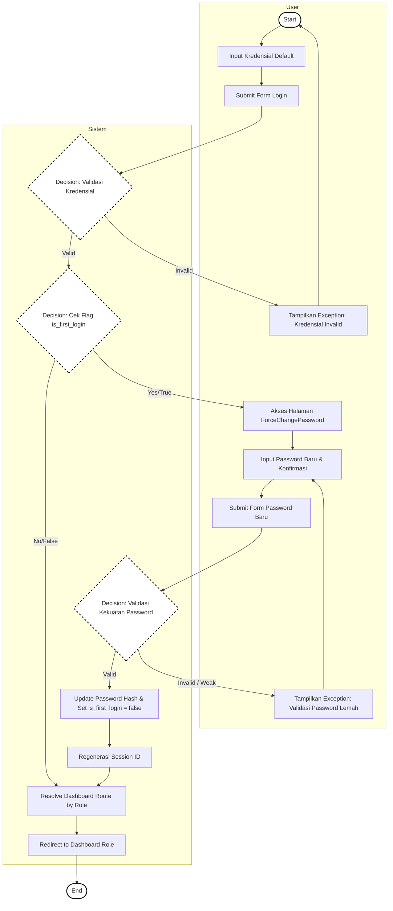

# Activity Diagram: First Login (Force Change Password)

```mermaid
flowchart TD
    %% Styling
    classDef startEnd fill:#fff,stroke:#000,stroke-width:2px;
    classDef decision fill:#fff,stroke:#000,stroke-dasharray: 5 5,stroke-width:2px;

    subgraph User
        A([Start]):::startEnd
        B[Input Kredensial Default]
        C[Submit Form Login]
        D[Tampilkan Exception: Kredensial Invalid]
        E[Akses Halaman ForceChangePassword]
        F[Input Password Baru & Konfirmasi]
        G[Submit Form Password Baru]
        H[Tampilkan Exception: Validasi Password Lemah]
    end

    subgraph Sistem
        I{Decision: Validasi Kredensial}:::decision
        J{Decision: Cek Flag is_first_login}:::decision
        K{Decision: Validasi Kekuatan Password}:::decision
        L[Update Password Hash & Set is_first_login = false]
        M[Regenerasi Session ID]
        N[Resolve Dashboard Route by Role]
        O[Redirect to Dashboard Role]
    end

    A --> B
    B --> C
    C --> I
    I -- Invalid --> D
    D --> A
    I -- Valid --> J
    
    J -- No/False --> N
    J -- Yes/True --> E
    
    E --> F
    F --> G
    G --> K
    K -- Invalid / Weak --> H
    H --> F
    K -- Valid --> L
    
    L --> M
    M --> N
    N --> O
    O --> Z([End]):::startEnd
```
