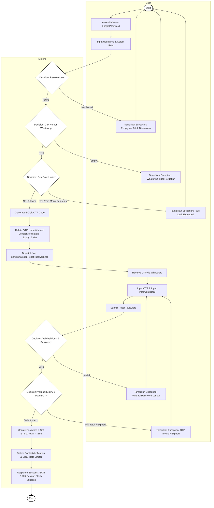

# Activity Diagram: Reset Password (via WhatsApp OTP)

```mermaid
flowchart TD
    %% Styling
    classDef startEnd fill:#fff,stroke:#000,stroke-width:2px;
    classDef decision fill:#fff,stroke:#000,stroke-dasharray: 5 5,stroke-width:2px;

    subgraph User
        A([Start]):::startEnd
        B[Akses Halaman ForgotPassword]
        C[Input Username & Select Role]
        D[Tampilkan Exception: Pengguna Tidak Ditemukan]
        E[Tampilkan Exception: WhatsApp Tidak Terdaftar]
        F[Tampilkan Exception: Rate Limit Exceeded]
        G[Receive OTP via WhatsApp]
        H[Input OTP & Input Password Baru]
        I[Submit Reset Password]
        J[Tampilkan Exception: OTP Invalid / Expired]
        K[Tampilkan Exception: Validasi Password Lemah]
    end

    subgraph Sistem
        L{Decision: Resolve User}:::decision
        M{Decision: Cek Nomor WhatsApp}:::decision
        N{Decision: Cek Rate Limiter}:::decision
        O[Generate 6-Digit OTP Code]
        P[Delete OTP Lama & Insert ContactVerification - Expiry: 5 Min]
        Q[Dispatch Job: SendWhatsappResetPasswordJob]
        R{Decision: Validasi Form & Password}:::decision
        S{Decision: Validasi Expiry & Match OTP}:::decision
        T[Update Password & Set is_first_login = false]
        U[Delete ContactVerification & Clear Rate Limiter]
        V[Response Success JSON & Set Session Flash Success]
    end

    A --> B
    B --> C
    C --> L
    L -- Not Found --> D
    D --> A
    L -- Found --> M
    
    M -- Empty --> E
    E --> A
    M -- Exist --> N
    
    N -- Yes / Too Many Requests --> F
    F --> A
    N -- No / Allowed --> O
    
    O --> P
    P --> Q
    Q --> G
    
    G --> H
    H --> I
    I --> R
    
    R -- Invalid --> K
    K --> H
    R -- Valid --> S
    
    S -- Mismatch / Expired --> J
    J --> H
    S -- Valid / Match --> T
    
    T --> U
    U --> V
    V --> Z([End]):::startEnd
```
