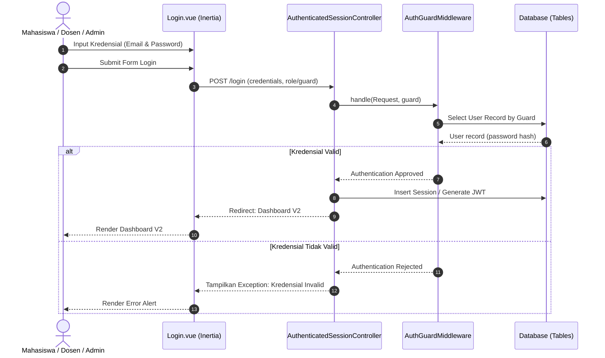

# Sequence Diagram: Autentikasi Multi-Guard (Login)

```mermaid
sequenceDiagram
    autonumber
    actor User as Mahasiswa / Dosen / Admin
    participant View as Login.vue (Inertia)
    participant Ctrl as AuthenticatedSessionController
    participant Middleware as AuthGuardMiddleware
    participant DB as Database (Tables)

    User->>View: Input Kredensial (Email & Password)
    User->>View: Submit Form Login
    View->>Ctrl: POST /login (credentials, role/guard)
    Ctrl->>Middleware: handle(Request, guard)
    Middleware->>DB: Select User Record by Guard
    DB-->>Middleware: User record (password hash)
    alt Kredensial Valid
        Middleware-->>Ctrl: Authentication Approved
        Ctrl->>DB: Insert Session / Generate JWT
        Ctrl-->>View: Redirect: Dashboard V2
        View-->>User: Render Dashboard V2
    else Kredensial Tidak Valid
        Middleware-->>Ctrl: Authentication Rejected
        Ctrl-->>View: Tampilkan Exception: Kredensial Invalid
        View-->>User: Render Error Alert
    end
```
