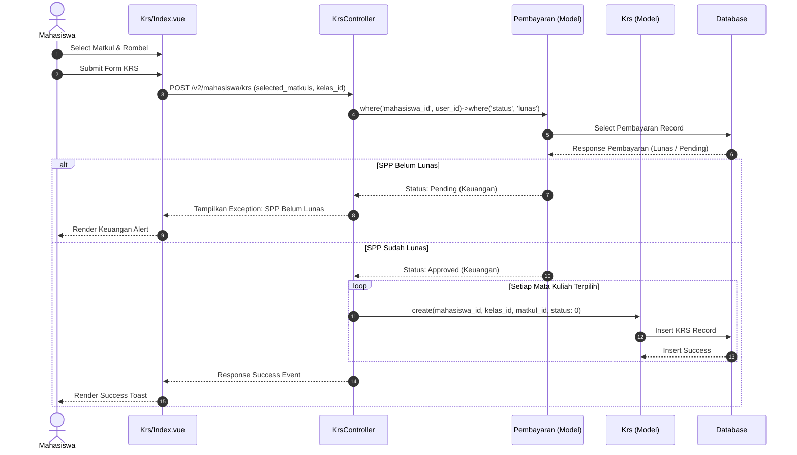

# Sequence Diagram: Simpan Formulir Kontrak KRS

```mermaid
sequenceDiagram
    autonumber
    actor Mahasiswa
    participant View as Krs/Index.vue
    participant Ctrl as KrsController
    participant PayModel as Pembayaran (Model)
    participant KrsModel as Krs (Model)
    participant DB as Database

    Mahasiswa->>View: Select Matkul & Rombel
    Mahasiswa->>View: Submit Form KRS
    View->>Ctrl: POST /v2/mahasiswa/krs (selected_matkuls, kelas_id)
    Ctrl->>PayModel: where('mahasiswa_id', user_id)->where('status', 'lunas')
    PayModel->>DB: Select Pembayaran Record
    DB-->>PayModel: Response Pembayaran (Lunas / Pending)
    alt SPP Belum Lunas
        PayModel-->>Ctrl: Status: Pending (Keuangan)
        Ctrl-->>View: Tampilkan Exception: SPP Belum Lunas
        View-->>Mahasiswa: Render Keuangan Alert
    else SPP Sudah Lunas
        PayModel-->>Ctrl: Status: Approved (Keuangan)
        loop Setiap Mata Kuliah Terpilih
            Ctrl->>KrsModel: create(mahasiswa_id, kelas_id, matkul_id, status: 0)
            KrsModel->>DB: Insert KRS Record
            DB-->>KrsModel: Insert Success
        end
        Ctrl-->>View: Response Success Event
        View-->>Mahasiswa: Render Success Toast
    end
```
