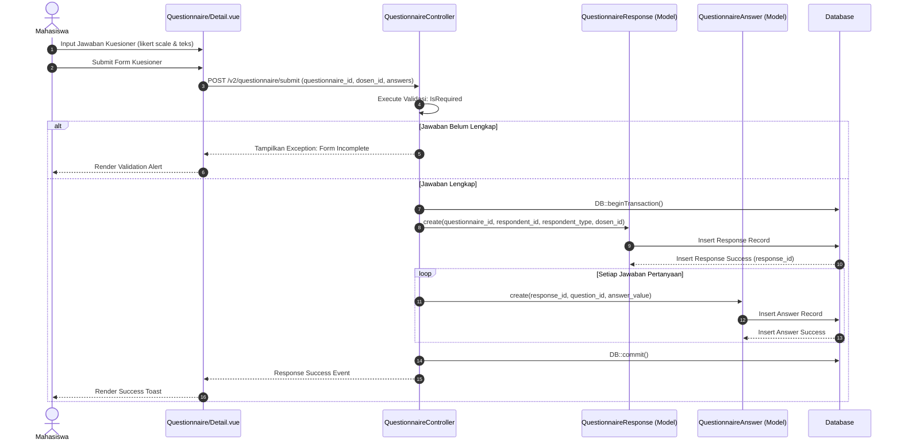

# Sequence Diagram: Submisi Respons Kuesioner Dosen

Sequence diagram ini menggambarkan alur umum pengisian kuesioner evaluasi oleh Mahasiswa, yang berlaku untuk evaluasi pelayanan kampus maupun evaluasi kinerja dosen. Mahasiswa mengisi instrumen penilaian serta mengirimkan formulir kuesioner, sistem melakukan validasi kelengkapan jawaban, lalu mengembalikan pesan kesalahan jika ada jawaban yang belum diisi. Setelah data kuesioner valid dan lengkap, sistem menyimpan data respons beserta rincian jawaban ke database dalam satu transaksi aman, dan akhirnya menampilkan notifikasi sukses. Alur ini mewakili mekanisme pengumpulan umpan balik mahasiswa untuk penjaminan mutu internal.
