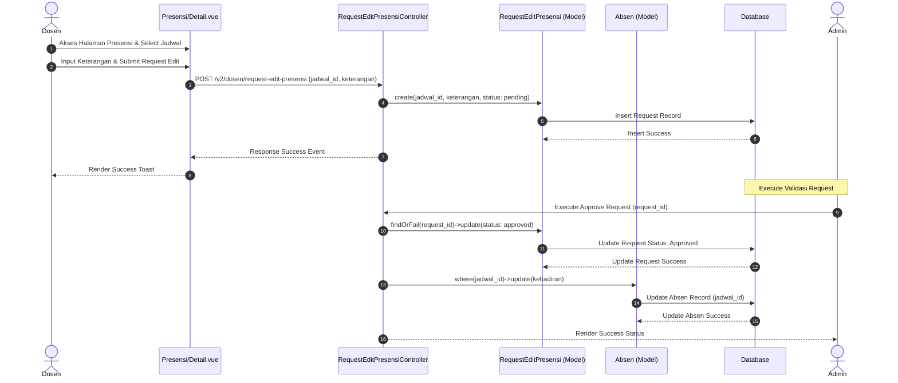

# Sequence Diagram: Pengajuan Edit Presensi Kuliah

Sequence diagram ini menggambarkan alur umum pengajuan perubahan kehadiran oleh Dosen dengan persetujuan Admin, yang berlaku untuk semua koreksi data presensi perkuliahan yang telah berlalu. Dosen mengisi data perubahan presensi serta mengirimkan permohonan edit, sistem menyimpan data pengajuan dengan status tertunda (pending) ke database, dan mengembalikan pesan sukses setelah pengajuan berhasil dikirim. Setelah admin melakukan verifikasi dan menyetujui permohonan tersebut, sistem memperbarui status pengajuan menjadi disetujui, memperbarui data kehadiran mahasiswa pada jadwal terkait di database, dan akhirnya menampilkan status keberhasilan kepada admin. Alur ini mewakili koordinasi dua tingkat dalam pengelolaan akurasi data absensi kuliah.
