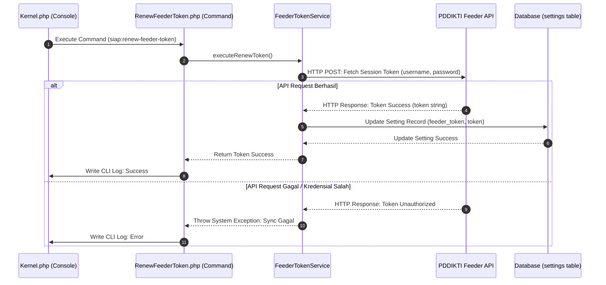

# Sequence Diagram: Pembaruan Otomatis Token Feeder

Sequence diagram ini menggambarkan alur umum pembaruan token akses otomatis oleh Scheduler, yang berlaku untuk sinkronisasi sesi komunikasi dengan server eksternal PDDIKTI. Scheduler menjalankan perintah terjadwal secara berkala, sistem melakukan permintaan token sesi baru ke API PDDIKTI Feeder menggunakan kredensial terdaftar, lalu mengembalikan pesan pengecualian dan menulis log error jika kredensial salah atau koneksi gagal. Setelah respons API valid dan token berhasil diperoleh, sistem memperbarui nilai token di database, dan akhirnya menulis laporan sukses pada sistem log. Alur ini mewakili proses pemeliharaan sesi integrasi data nasional yang berjalan di latar belakang.
