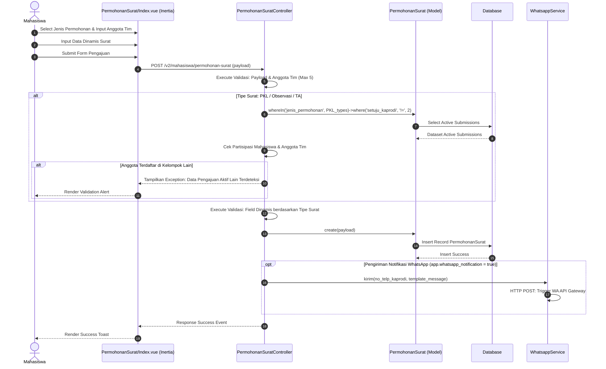

# Sequence Diagram: Pengajuan Surat

Sequence diagram ini menggambarkan alur umum pengajuan surat akademik oleh Mahasiswa, yang berlaku untuk beberapa kategori surat seperti PKL, observasi, dan tugas akhir. Mahasiswa mengisi jenis surat beserta data kelompok dan field dinamis lainnya, sistem melakukan validasi batas anggota kelompok dan memeriksa keaktifan pengajuan serupa di database, lalu mengembalikan pesan kesalahan jika ditemukan duplikasi partisipasi aktif anggota kelompok. Setelah seluruh data dinyatakan valid, sistem menyimpan data permohonan baru ke database, memicu pengiriman notifikasi WhatsApp otomatis ke ketua program studi jika fitur diaktifkan, dan akhirnya menampilkan status sukses pengajuan. Alur ini mewakili standardisasi prosedur administrasi surat menyurat mahasiswa.
