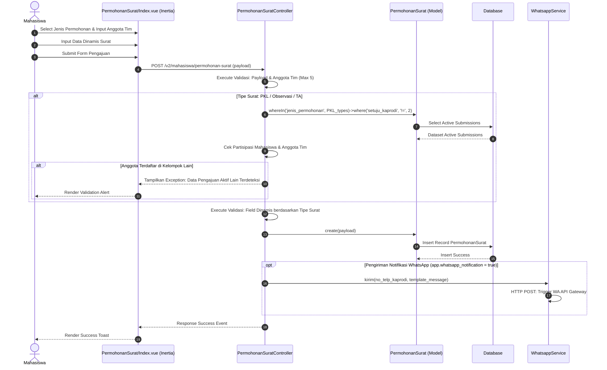

# Sequence Diagram: Pengajuan Surat

```mermaid
sequenceDiagram
    autonumber
    actor Mahasiswa
    participant View as PermohonanSurat/Index.vue (Inertia)
    participant Ctrl as PermohonanSuratController
    participant Model as PermohonanSurat (Model)
    participant DB as Database
    participant Service as WhatsappService

    Mahasiswa->>View: Select Jenis Permohonan & Input Anggota Tim
    Mahasiswa->>View: Input Data Dinamis Surat
    Mahasiswa->>View: Submit Form Pengajuan
    View->>Ctrl: POST /v2/mahasiswa/permohonan-surat (payload)
    Ctrl->>Ctrl: Execute Validasi: Payload & Anggota Tim (Max 5)
    
    alt Tipe Surat: PKL / Observasi / TA
        Ctrl->>Model: whereIn('jenis_permohonan', PKL_types)->where('setuju_kaprodi', '!=', 2)
        Model->>DB: Select Active Submissions
        DB-->>Model: Dataset Active Submissions
        Ctrl->>Ctrl: Cek Partisipasi Mahasiswa & Anggota Tim
        alt Anggota Terdaftar di Kelompok Lain
            Ctrl-->>View: Tampilkan Exception: Data Pengajuan Aktif Lain Terdeteksi
            View-->>Mahasiswa: Render Validation Alert
        end
    end

    Ctrl->>Ctrl: Execute Validasi: Field Dinamis berdasarkan Tipe Surat
    Ctrl->>Model: create(payload)
    Model->>DB: Insert Record PermohonanSurat
    DB-->>Model: Insert Success
    
    opt Pengiriman Notifikasi WhatsApp (app.whatsapp_notification = true)
        Ctrl->>Service: kirim(no_telp_kaprodi, template_message)
        Service->>Service: HTTP POST: Trigger WA API Gateway
    end

    Ctrl-->>View: Response Success Event
    View-->>Mahasiswa: Render Success Toast
```
