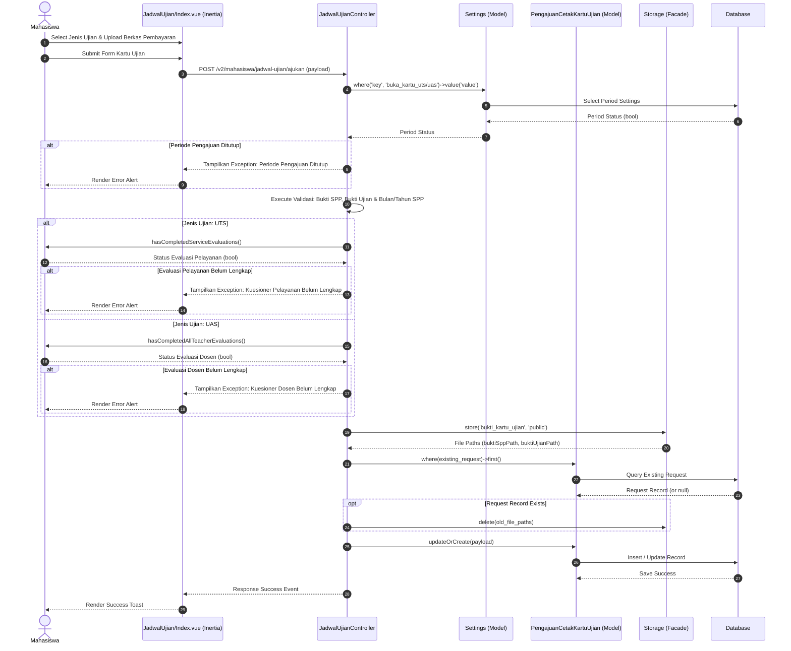

# Sequence Diagram: Pengajuan Kartu Ujian

Sequence diagram ini menggambarkan alur umum pengajuan cetak kartu ujian oleh Mahasiswa, yang berlaku untuk pelaksanaan ujian tengah semester (UTS) dan ujian akhir semester (UAS). Mahasiswa mengunggah berkas pembayaran serta memilih jenis ujian, sistem melakukan validasi status buka-tutup periode cetak kartu dan memeriksa kelengkapan pengisian kuesioner evaluasi wajib di database, lalu mengembalikan pesan penolakan jika periode ditutup atau kuesioner belum lengkap. Setelah seluruh syarat terpenuhi dan berkas baru berhasil disimpan ke penyimpanan publik, sistem membuat atau memperbarui rekaman pengajuan di database serta menghapus berkas lama jika ada, dan akhirnya menampilkan pesan sukses cetak kartu. Alur ini mewakili pengondisian syarat akademik dan keuangan sebelum masa ujian berlangsung.
