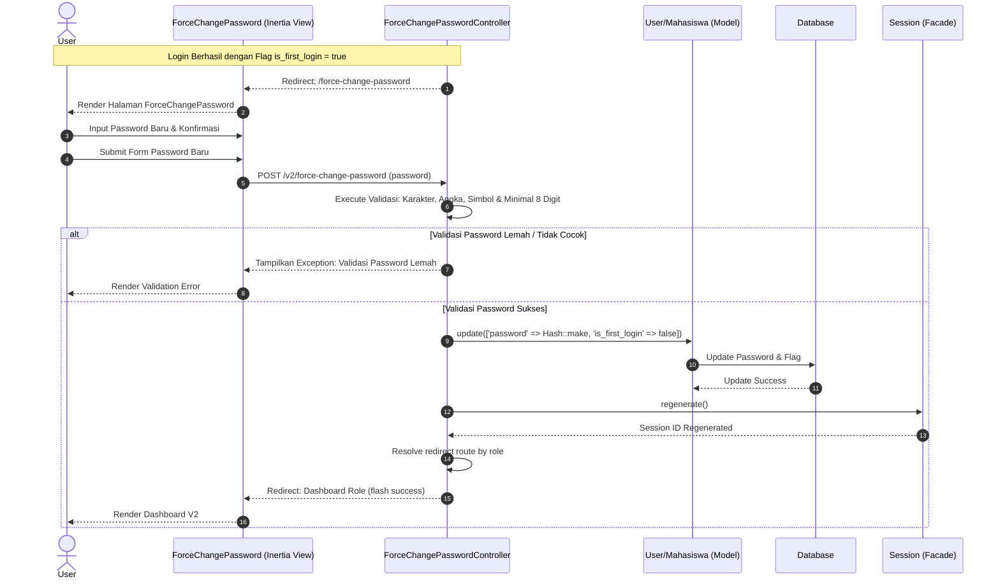

# Sequence Diagram: First Login (Force Change Password)

Sequence diagram ini menggambarkan alur umum pergantian password wajib saat login pertama oleh Pengguna baru, yang berlaku bagi semua pengguna yang belum pernah memperbarui kredensial bawaan mereka. Pengguna diarahkan ke halaman khusus setelah login dengan penanda login pertama aktif, sistem melakukan validasi kekuatan kata sandi baru yang dimasukkan, lalu mengembalikan pesan kesalahan jika kata sandi dinilai terlalu lemah atau tidak memenuhi syarat minimal keamanan. Setelah kata sandi baru dinyatakan valid, sistem memperbarui hash sandi serta mematikan bendera login pertama di database, meregenerasi ID sesi untuk keamanan, dan akhirnya mengarahkan pengguna ke dasbor peran masing-masing dengan pesan sukses. Alur ini mewakili pertahanan awal dalam mengamankan hak akses pengguna baru.
