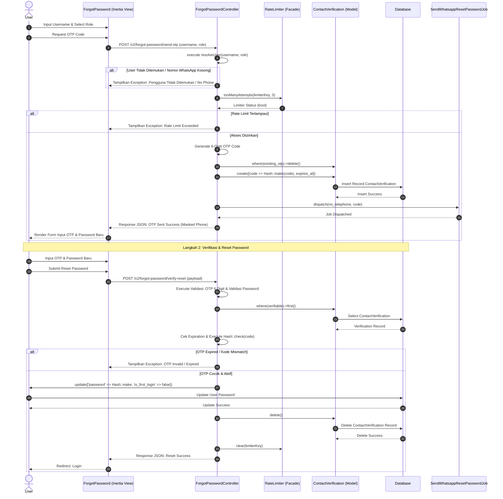

# Sequence Diagram: Reset Password (via WhatsApp OTP)

Sequence diagram ini menggambarkan alur umum pemulihan kata sandi melalui kode OTP WhatsApp oleh Pengguna yang lupa kredensialnya, yang berlaku untuk seluruh aktor yang terdaftar dalam sistem. Pengguna meminta kode verifikasi dengan mengirimkan nama pengguna dan peran, sistem melakukan validasi status akun serta batasan frekuensi pengiriman (rate limit) di database, lalu mengembalikan pesan kesalahan jika data tidak sesuai atau batas percobaan terlampaui. Setelah verifikasi awal sukses dan OTP baru terkirim melalui antrean pesan WhatsApp, pengguna memasukkan kode beserta kata sandi baru yang kemudian divalidasi oleh sistem, dan akhirnya memperbarui data kredensial serta menghapus token verifikasi di database ketika data tersebut dinyatakan valid. Alur ini mewakili prosedur pemulihan mandiri dengan verifikasi dua langkah (2FA) berbasis nomor kontak terdaftar.
